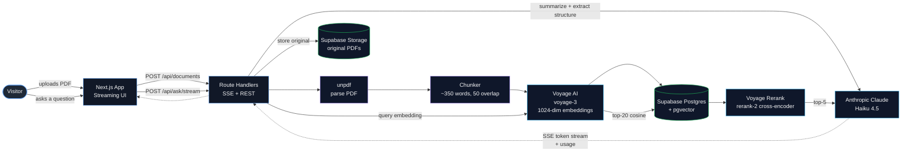
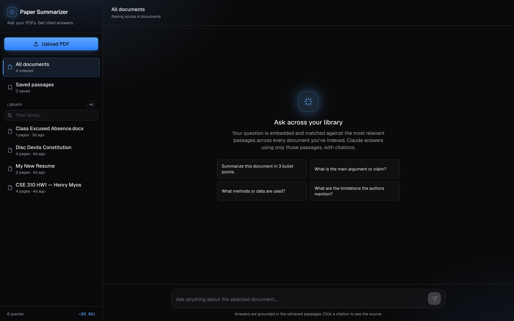
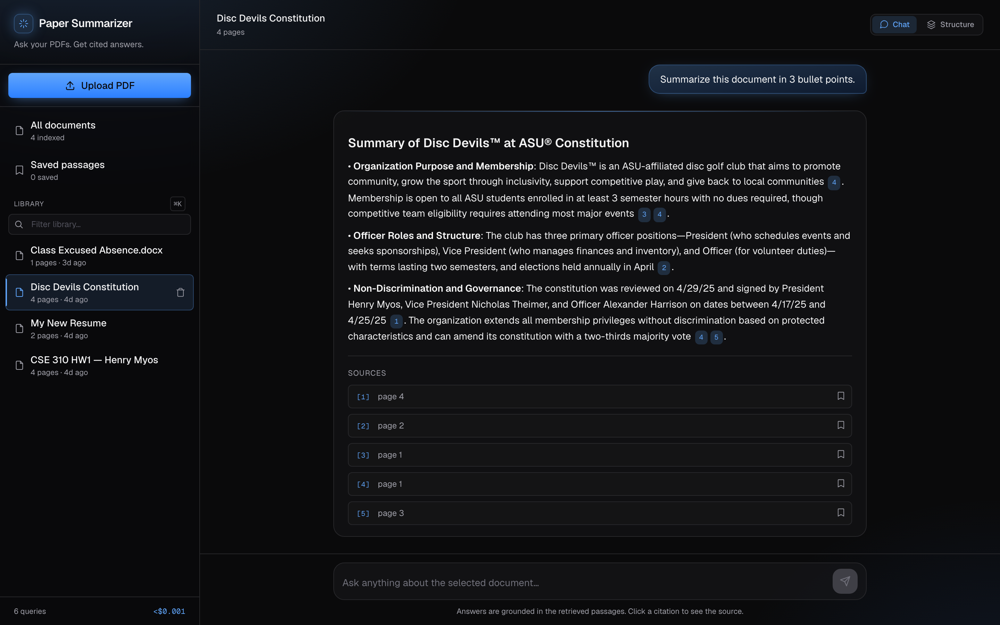
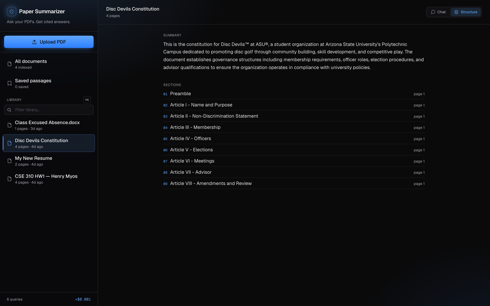
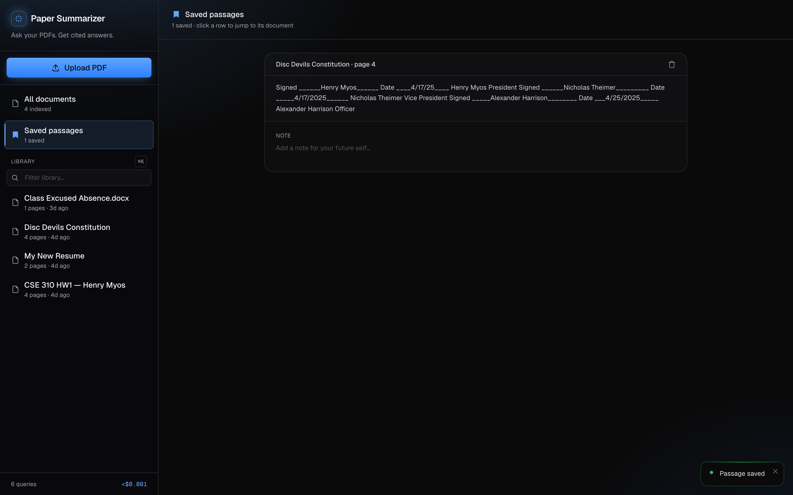

# Paper Summarizer

> Retrieval-augmented Q&A over PDFs. Upload a paper, ask questions, get grounded answers with citations to the source paragraphs.

**[→ Live demo](https://paper-summarizer-neon.vercel.app)** &nbsp;·&nbsp; Next.js · TypeScript · Supabase + pgvector · Voyage AI · Anthropic Claude

---

## What it does

Drop in a PDF and the app indexes it into a vector database. Ask a question and it:

1. Embeds the question with **Voyage AI**.
2. Pulls the 20 most similar chunks from **pgvector**.
3. **Reranks** them with Voyage's cross-encoder to a sharper top-5.
4. Streams a **grounded answer from Claude** that cites the chunks it used inline (`[1]`, `[2]`, `[2,3]`).

You also get, automatically on upload:
- A **2–3 sentence summary** + **4 starter questions** tailored to the document
- An extracted **outline** of sections, figures, and tables
- A parsed **references** list, with cross-matching against other documents in your library

You can **save** any cited passage to a permanent library, add a note, and jump back to its source document.

---

## Architecture



### Why these choices

- **pgvector inside Supabase** — keeps storage, search, auth, and migrations on one Postgres. Avoids running a second vector DB like Pinecone or Weaviate.
- **Voyage `voyage-3` for embeddings** — better retrieval quality than OpenAI's `text-embedding-3-small` at a comparable price. Voyage's rerank-2 cross-encoder is the cleanest re-ranking I've found.
- **Two-stage retrieval (vector + rerank)** — vector search is cheap and recall-focused; the cross-encoder is expensive but precision-focused. Combining them is meaningfully better than either alone.
- **Streaming via SSE** — first event carries the retrieved chunks (so sources render immediately), then a stream of token deltas, then a done event. Token deltas batch via `requestAnimationFrame` to avoid re-rendering the markdown tree per byte.
- **Cookie-based per-visitor identity** — a `proxy.ts` (Next 16's successor to middleware) sets a stable `visitor_id` cookie on first request. Each browser gets its own private library without a sign-in flow.
- **Custom remark plugin** — turns `[n]` tokens into clickable citation pills while keeping markdown formatting (headers, lists, code blocks, tables) intact.

---

## Screenshots

| Library overview | Streaming answer with citations |
|---|---|
|  |  |

| Document structure tab | Saved passages library |
|---|---|
|  |  |

> Captured at 1440×900 @ 2× DPI by `scripts/screenshots.ts` (Playwright). Regenerate locally with `npx tsx scripts/screenshots.ts`. The References tab also exists; it only activates when the indexed document has a parsed bibliography.

---

## Feature list

**Retrieval**
- Voyage `voyage-3` embeddings (1024-dim)
- pgvector with ivfflat cosine index
- Two-stage retrieve: top-20 vector → rerank-2 → top-5
- Per-document or whole-library scope

**Answer generation**
- Claude Haiku 4.5 with strict "use only the passages" system prompt
- Server-Sent Events streaming
- Markdown rendering (headers, lists, code, tables, blockquotes)
- Custom inline citation pills (`[1]`, `[2,3]`) that highlight the source row

**Upload pipeline**
- PDF parsing via `unpdf`
- Word-based chunking with overlap
- Parallel Claude call extracts summary + 4 starter questions + sections + figures/tables + references — single round-trip
- Original PDF stashed in Supabase Storage so the in-app viewer can open the cited page

**UI**
- Dark mode with ambient blue radial-gradient background
- Mobile-responsive drawer sidebar
- Sidebar search with ⌘K
- Toast notifications for upload / ask / save events
- Loading skeletons during hydrate
- Confirmation modal for destructive actions
- Per-document tabs: Chat / Structure / References
- Saved-passages library with editable per-passage notes

**Engineering**
- Per-visitor isolation via httpOnly cookie + Next.js proxy
- Prompt caching on the system prompt for repeated-context cost savings
- Per-query token / cost tracking surfaced in the sidebar
- Row-Level Security on every table; admin client only used server-side
- Vercel auto-deploy from GitHub on push to `main`

---

## Tech stack

| Layer | Choice |
|---|---|
| Framework | Next.js 16 (App Router, Turbopack) |
| Language | TypeScript |
| Styling | Tailwind v4, Geist font, custom dark theme |
| Database | Supabase Postgres + pgvector |
| File storage | Supabase Storage |
| Embeddings | Voyage AI (`voyage-3`) |
| Reranking | Voyage AI (`rerank-2`) |
| LLM | Anthropic Claude (Haiku 4.5) |
| PDF parsing | `unpdf` |
| PDF rendering | `react-pdf` |
| Markdown | `react-markdown` + `remark-gfm` + custom citation plugin |
| Validation | `zod` |
| Hosting | Vercel |

---

## Running locally

```bash
git clone https://github.com/henrymyos/paper-summarizer.git
cd paper-summarizer
npm install

cp .env.example .env.local
# Fill in: Supabase URL + anon key + service role, Anthropic key, Voyage key

# Apply the schema in your Supabase project (one-shot)
# Paste supabase/schema.sql into the Supabase SQL editor and run.

npm run dev
# → http://localhost:3000
```

You can also exercise the pipeline from the command line:

```bash
npm run index-pdf -- ./papers/some-paper.pdf
npm run ask -- "What did the paper conclude?"
```

---

## Repository layout

```
app/
  api/
    documents/        upload, list, delete
    documents/[id]/   per-doc operations
    ask/              non-streaming ask (legacy)
    ask/stream/       SSE-based streaming ask
    annotations/      saved-passage CRUD
    queries/          conversation history
    opengraph-image/  dynamic 1200x630 OG image
  page.tsx            main shell — sidebar + chat/saved view
  layout.tsx          metadata, fonts, theme color
  globals.css         ambient blue glow + custom keyframes
components/           chat, sidebar, markdown, modals, toasts
lib/
  pdf.ts              unpdf wrapper
  chunking.ts         word-based chunker with overlap
  embeddings.ts       Voyage embed (direct fetch)
  rerank.ts           Voyage cross-encoder rerank
  answer.ts           Claude non-streaming response
  answer-stream.ts    Claude streaming with cache_control
  indexing.ts         parse → chunk → embed → store pipeline
  summarize.ts        per-document summary + structure + references extraction
  retrieval.ts        retrieve → answer (used by /api/ask)
  supabase/           browser, server, admin clients
  user.ts             reads visitor_id cookie
proxy.ts              sets visitor_id cookie on first request
scripts/
  index-pdf.ts        CLI: index a PDF
  ask.ts              CLI: ask a question
supabase/
  schema.sql          full DB schema (tables, indexes, RLS, RPC)
```

---

## Resume bullets

```
Paper Summarizer — Personal Project
  Next.js · TypeScript · Supabase (Postgres + pgvector) · Voyage AI · Claude API · Vercel

• Built a full-stack RAG application that indexes user-uploaded PDFs and
  answers questions with citations grounded in the retrieved passages.

• Designed a two-stage retrieval pipeline (cosine similarity in pgvector
  followed by Voyage cross-encoder reranking) and a streaming SSE endpoint
  that emits chunks first then token deltas, so sources render before the
  answer begins.

• Implemented per-visitor data isolation via Next.js proxy + httpOnly
  cookie, prompt caching on the system prompt, per-query token + cost
  tracking, and a custom remark plugin that renders [n] citations as
  clickable pills inside rendered markdown.
```

---

Built with care by [Henry Myos](https://github.com/henrymyos).
